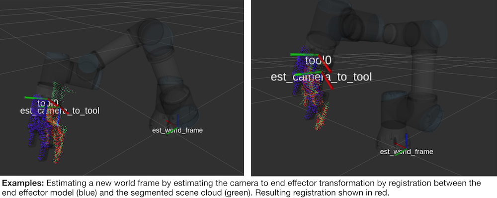
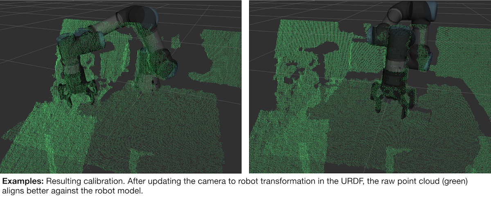

# seline
The purpose of `seline` is to use model-based pose estimation to estimate the transformation between the base of the robot and the camera frame. This is first done by estimating the pose of the robot's end effector in the camera optical frame. Then using the known relative transformations between the end effector and the base of the robot, transformation between the `camera_link` and the `world` is obtained. The key insight is that a sufficiently good seed is required for pose estimation, meaning that `seline` is used to *refine* the current eye-hand transform, not to produce one from scratch.

Currently, `seline` achieves on the order of 0.6cm of max error in a workspace of about a meter.

## Examples
Given the observed segmented scene point cloud in green, `seline` estimates the end effector pose using the forward kinematics as a seed (blue) and performs point to point ICP with the segmented scene cloud (green). This results in the estimated camera to end effector transformation. Since we know the forward kinematics, we can compute the end effector to world tranform (as described by the robot's URDF), and back out the estimated new world frame.




## Assumptions
 1. The robot has sufficiently good forward kinematics.
 2. A decent seed is available, meaning that the current URDF for the robot must have a connected tree that has both the camera and the base of the robot. And that the current eye-hand achieves, say less than 5-10cm of error.
 3. A `.pcd` model of the end effector is available.

## Procedure
How `seline` works is as follows. The forward kinematics of the robot is used to obtain a seed location of where the robot believes its end effector is relative to the camera. An epsilon ball is created around this initial seed. We then pull out points from the raw scene point cloud that fall within this epsilon ball and treat the resulting "segmented" point cloud as the target for registration. We seed the model (the cloud corresponding to the end effector) at the pose given by forward kinematics and do point to point ICP between the end effector model and the segmented scene cloud. Doing so obtains an estimated camera to end effector transform which is used to estimate the transformation between the `camera_link` and `world`.

## Requirements
The following are dependencies for `seline`,
 * Robot Operating System (ROS), Point Cloud Library (PCL), Eigen
 * [transform_conversions](https://github.com/jaymwong/transform_conversions) - a convenience ROS package for transforms

## Usage
Currently, `seline` requires just a single end effector pose for obtaining good eye-hand. First, drive the end effector towards the center of the workspace (or image plane) with the gripper surface being perpendicular to the camera optical frame's Z-axis. As shown in the examples in the previous section. Next run `seline` to acquire a new `camera_link` to `world` transform.

An example configuration file is in `seline/config`. For your setting, create a new configuration file and edit `seline/launch/seline.launch` to use this new configuration file. Then simply do,
```
roslaunch seline seline.launch
```
Finally, to obtain the new camera to world transformation, do
```
cd seline/scripts; python process_data.py;
```
This will print out the transformation in URDF friendly format. For example, 
```
<link name="camera_link"/>
<joint name="camera_to_robot" type="fixed">
  <parent link="camera_link"/>
  <child link="world"/>
  <origin xyz="1.5460137711 -0.0991888599915 0.295267672157" rpy="-0.546406834079 -0.00742609072367 1.53930854082" />
</joint>
```
A final convience launch file will publish the calibrated transformation between the `camera_link` and the `base_link` (or `world`) directly from `seline`,
```
roslaunch seline tf_broadcaster.launch
```

## Notes
__Multiple End Effector Poses + Least Squares Minimization.__ This is currently under works. We are currently writing a procedure to automatically send the end effector to various locations in the scene, for each location estimate the new world frame, and perform a regression over the set of estimated frames.

__Fixed-base Robotic Arms.__ In reality the `world_frame` is described here is actually the robot's `base_link`; this README is using them as if they are interchangable since `seline` was originally designed for a robot with a fixed base. For mobile systems, the `world_frame` in the configuration file should refer to the robot's `base_link`.

