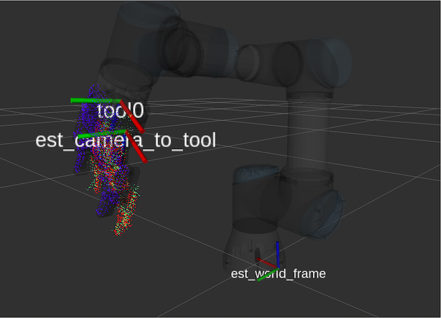

# seline
The purpose of `seline` is to use model-based pose estimation to estimate the transformation between the base of the robot and the camera frame. This is done by estimating the pose of the end effector and backing out the transform to estimate the new base frame. The key insight is that a sufficiently good seed is required for pose estimation, meaning that `seline` is used to *refine* the current eye-hand transform, not to produce one from scratch.

## Assumptions
 1. The robot has sufficiently good forward kinematics.
 2. A decent seed is available, meaning that the current URDF for the robot must have a connected tree that has both the camera and the base of the robot.
 3. A `.pcd` model of the end effector is available.
 
## Procedure
How `seline` works is as follows. The forward kinematics of the robot is used to obtain a seed location of where the robot believes its end effector is relative to the camera. An epsilon ball is created around this initial seed. We go through the raw point cloud and obtain all points in the scene within this epsilon ball and treat this as the target cloud for registration. We then seed the model (the cloud corresponding to the end effector) at where pose given by forward kinematics and do point to point ICP between the end effector model and the segmented scene cloud. Doing so obtains an estimated camera to end effector transform which is used to estimate where the transformation for base of the robot.
 
## Requirements
The following are dependencies for `seline`,
 * Robot Operating System (ROS), Point Cloud Library (PCL), Eigen
 * [transform_conversions](https://github.com/jaymwong/transform_conversions) - a convenience ROS package for transforms

## Usage
An example configuration file is in `seline/config`. For your setting, create a new configuration file and edit `seline/launch/seline.launch` to use this new configuration file. Then simply do,
```roslaunch seline seline.launch```
Finally, to obtain the new camera to world transformation, do
```
cd seline/scripts; python process_data.py;
```
__TODO:__ We are currently writing a procedure to automatically send the arm to various locations in the scene, for each location estimate the new world frame, and perform a regression over the set of estimated frames. 

## Examples
Given the observed segmented scene pointcloud in green, `seline` estimates the end effector pose using the forward kinematics as a seed (blue) and performs point to point ICP with the segmented scene cloud (green). This results in the estimated camera to end effector transformation. Since we know the forward kinematics, we can compute the end effector to world tranform (as described by the robot's URDF), and back out the estimated new world frame.


